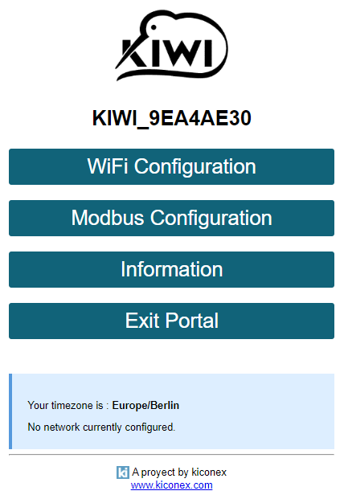
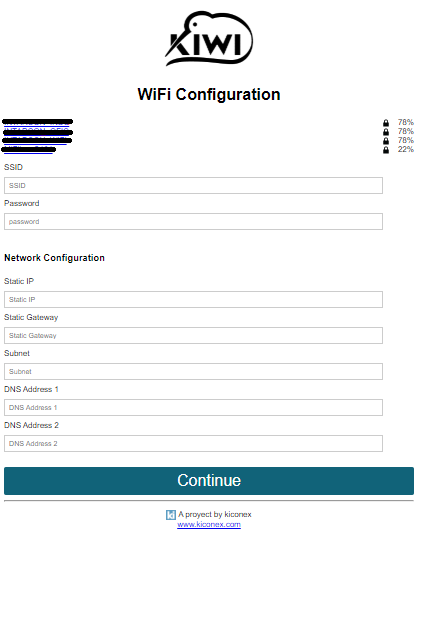
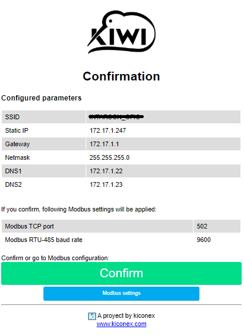
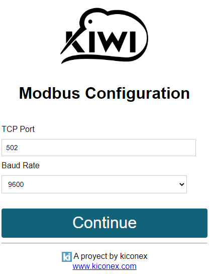
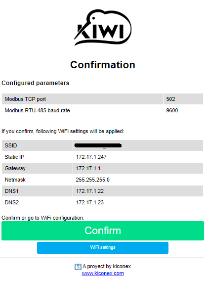
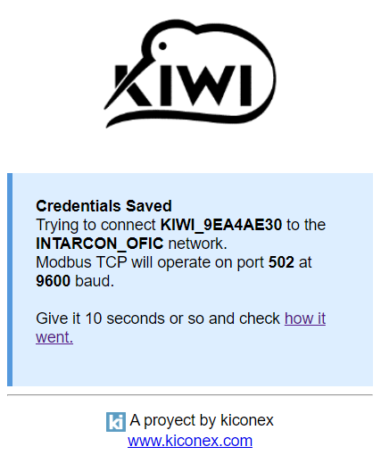

<!--
*** Thanks for checking out this README Template. If you have a suggestion that would
*** make this better, please fork the repo and create a pull request or simply open
*** an issue with the tag "enhancement".
*** Thanks again! Now go create something AMAZING! :D
***
***
***
*** To avoid retyping too much info. Do a search and replace for the following:
*** github_username, repo, twitter_handle, email
-->


<!-- PROJECT SHIELDS -->
<!--
*** I'm using markdown "reference style" links for readability.
*** Reference links are enclosed in brackets [ ] instead of parentheses ( ).
*** See the bottom of this document for the declaration of the reference variables
*** for contributors-url, forks-url, etc. This is an optional, concise syntax you may use.
*** https://www.markdownguide.org/basic-syntax/#reference-style-links
-->
<!--[![Contributors][contributors-shield]][contributors-url]
[![Forks][forks-shield]][forks-url]
[![Stargazers][stars-shield]][stars-url]
[![Issues][issues-shield]][issues-url]
[![MIT License][license-shield]][license-url]
[![LinkedIn][linkedin-shield]][linkedin-url]-->


<!-- PROJECT LOGO -->
<br />
<p align="center">
  <a href="https://github.com/Kiconex-IoT/KiWi">
    
  </a>

  <h3 align="center">KiWi</h3>

  <p align="center">
    Kiconex Wireless
    <br />
    <a href="https://github.com/Kiconex-IoT/KiWi"><strong>Explore the docs »</strong></a>
    <br />
    <br />
    <a href="https://github.com/Kiconex-IoT/KiWi">View Demo</a>
    ·
    <a href="https://github.com/Kiconex-IoT/KiWi/issues">Report Bug</a>
    ·
    <a href="https://github.com/Kiconex-IoT/KiWi/issues">Request Feature</a>
  </p>
</p>


<!-- TABLE OF CONTENTS -->
## Table of Contents

* [About the Project](#about-the-project)
  * [Built With](#built-with)
* [How it Works](#how-it-works)
  * [Arduino IDE preparation](#arduino-ide-preparation)
  * [KiWi download and installation](#kiwi-download-and-installation)
  * [Usage](#usage)
* [Issues](#issues)
<!--
* [Contributing](#contributing)
* [License](#license)
-->
* [Contact](#contact)
<!--
* [Acknowledgements](#acknowledgements)
-->


<!-- ABOUT THE PROJECT -->
## About The Project

<p align="center">
      <a href="https://github.com/Kiconex-IoT/KiWi">
         
      </a>
</p>

KiWi is a Kiconex Modbus bridge. It work like a Modbus TCP slave and a Modbus TCP master. KiWi receives messages via WiFi from a Kiconex TCP master and resend them to Modbus RTU slaves.
KiWi can be configured on a web portal: WiFi network, Modbus TCP port and Modbus RTU baud rate.

### Built With

* [Olimex ESP-32 POE](https://www.olimex.com/Products/IoT/ESP32/ESP32-POE/open-source-hardware)
* [IDE Arduino](https://www.arduino.cc/en/Main/Software)
* [KiconexWiFiManager library]()
* [KiconexModbusRTU library]()
* [KiconexModbusBridge library]()


<!-- GETTING STARTED -->

## How it Works

Follow this steps to upload the program on a [Olimex ESP32-POE](https://www.olimex.com/Products/IoT/ESP32/ESP32-POE/open-source-hardware) and use KiWi.

### Arduino IDE preparation and upload

1. Go to **Files>>Preferences**.

2. Add this URL to **Additional Boards Manager URLs**:
```
https://raw.githubusercontent.com/espressif/arduino-esp32/gh-pages/package_esp32_index.json
```
3. Go to **Tools>>Board>>Board Manager**, search for **ESP32** and press **install**.
4. Go to **Tools>>Board** and select **OLIMEX ESP32-POE** board.

### KiWi download and installation
1. Clone repository:
```
git clone https://github.com/Kiconex-IoT/KiWi KiWi
```
2. Run **KiWi.ino** on Arduino IDE.
3. Compile **Program>>Compile**.
4. Upload **Program>>Upload**.

<!-- USAGE EXAMPLES -->
### Usage

#### AP Mode

When you run KiWi the first time, create a open WiFi network named **KIWI_XXXXXXXX**.
You can connect to it and you will be redirected to configuration portal at IP 192.168.4.1.

<p align="center">
      <a href="https://github.com/Kiconex-IoT/KiWi">
         
      </a>
</p>

If you go to **WiFi Configuration** yo will see available networks with their signals.

<p align="center">
      <a href="https://github.com/Kiconex-IoT/KiWi">
         
      </a>
</p>

After configure a network, click on **Continue** and go to the confirmation page. Here, you can see default Modbus configuration (TCP port 502 and baud rate 9600). 

You can confirm or if you want a different Modbus Configuration, you can go to **Modbus Configuration**.

<p align="center">
      <a href="https://github.com/Kiconex-IoT/KiWi">
         
      </a>
</p>

<p align="center">
      <a href="https://github.com/Kiconex-IoT/KiWi">
         
      </a>
</p>

Modbus Configuration have a confirm tab too.

<p align="center">
      <a href="https://github.com/Kiconex-IoT/KiWi">
         
      </a>
</p>

At end, when you confirm, you go to a new tab wich indicates that changes is being applied. If you wait 10 seconds and click on **How it went**, you will be redirected to KiWi static IP configured, ***if your dispositive is now connected to the same WiFi network***.

<p align="center">
      <a href="https://github.com/Kiconex-IoT/KiWi">
         
      </a>
</p>

<!-- ROADMAP -->
## Issues

See the [open issues](https://github.com/Kiconex-IoT/KiWi/issues) for a list of proposed features (and known issues).


<!-- CONTRIBUTING 
## Contributing

Contributions are what make the open source community such an amazing place to be learn, inspire, and create. Any contributions you make are **greatly appreciated**.

1. Fork the Project
2. Create your Feature Branch (`git checkout -b feature/AmazingFeature`)
3. Commit your Changes (`git commit -m 'Add some AmazingFeature'`)
4. Push to the Branch (`git push origin feature/AmazingFeature`)
5. Open a Pull Request
-->


<!-- LICENSE -->
## License

Distributed under the MIT License. See `LICENSE` for more information.


<!-- CONTACT -->
## Contact

Kiconex - [kiconex.es](https://www.kiconex.com/)

email - [support@kiconex.es](support@kiconex.es)

Project Link: [https://github.com/Kiconex-IoT/KiWi](https://github.com/Kiconex-IoT/KiWi)


<!-- ACKNOWLEDGEMENTS 
## Acknowledgements

* []()
* []()
* []()
-->


<!-- MARKDOWN LINKS & IMAGES -->
<!-- https://www.markdownguide.org/basic-syntax/#reference-style-links -->
<!--
[contributors-shield]: https://img.shields.io/github/contributors/othneildrew/Best-README-Template.svg?style=flat-square
[contributors-url]: https://github.com/othneildrew/Best-README-Template/graphs/contributors
[forks-shield]: https://img.shields.io/github/forks/othneildrew/Best-README-Template.svg?style=flat-square
[forks-url]: https://github.com/othneildrew/Best-README-Template/network/members
[stars-shield]: https://img.shields.io/github/stars/othneildrew/Best-README-Template.svg?style=flat-square
[stars-url]: https://github.com/othneildrew/Best-README-Template/stargazers
[issues-shield]: https://img.shields.io/github/issues/othneildrew/Best-README-Template.svg?style=flat-square
[issues-url]: https://github.com/othneildrew/Best-README-Template/issues
[license-shield]: https://img.shields.io/github/license/othneildrew/Best-README-Template.svg?style=flat-square
[license-url]: https://github.com/othneildrew/Best-README-Template/blob/master/LICENSE.txt
[linkedin-shield]: https://img.shields.io/badge/-LinkedIn-black.svg?style=flat-square&logo=linkedin&colorB=555
-->
[linkedin-url]: https://www.linkedin.com/company/kiconex/
[product-screenshot]: images/kiwi.png
